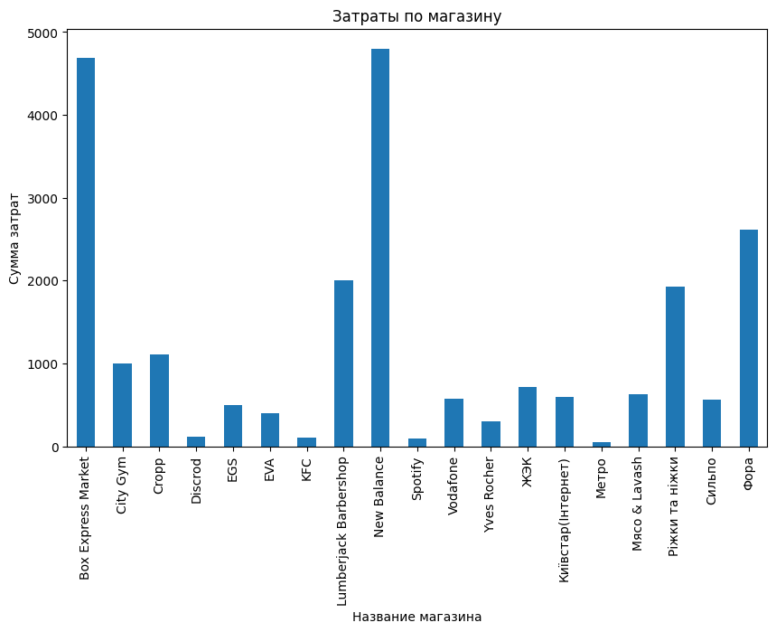
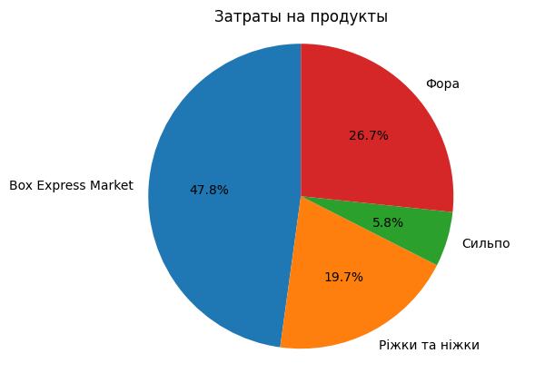
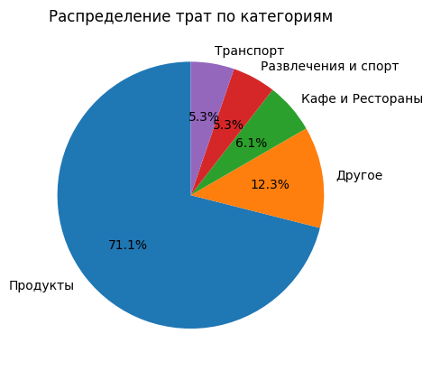

## Ledger
This is a web application for the implementation of a financial book.

### Features
Create and view spendings.

### Preparations
Make sure you have initialized PostgreSQL database, created tables [similar to](./core/models.py) Django ORM. You can fill 3/4 tables with [category](ledger_category_202304212006.csv), [shop](ledger_shop_202304212005.csv), [operation type](ledger_operation_type_202304212006.csv) or create on your own.

### Project realization
   1. [Django ORM](./core/models.py)
   2. [Django Forms](./core/forms.py)
   3. [Views](./core/views.py) </br>

### Initializing
1.  Activate virtual enviroment using 
```shell
venv\Scripts\Activate
```
2.  Run 
   ``` python
   python manage.py runserver
   ```
### Usage
To fill table ledger_fiscal_operations use /create_fiscal_operations or **Создать операцию**

### Output
Example output of [database](ledger_fiscal_operations_202304212006.csv)

### Example outputs of working with dataset using [notebook](ds.ipynb)
1.   All [spending](fiscal_operations.csv) and image 
2.   Spending on [food](product.csv) and image 
3.   Spending by [category](category.csv) and image 
